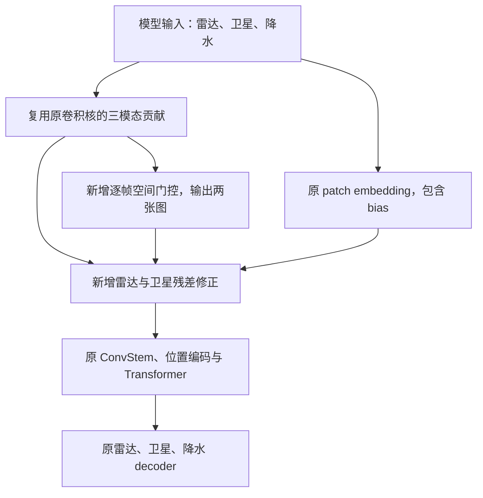

# gated_modality_rain_trainer 第一版功能总结

_RainPrediction · 2026-09-03 · 汇总第一版门控、CUDA 测试修正、原文件恢复与独立框架迁移_

---

## 📦 最新组织方式：独立模型与 trainer

用户要求保留原 baseline／他人代码，因此撤销了本任务在原模型和原 trainer 中加入的门控接入逻辑，并在 `src/gated_modality_rain/` 新建真正的实现副本。第一版门控公式保留；后续扩展只修改我们的文件，不在原文件中继续加功能。

| 文件 | 当前职责 |
| --- | --- |
| [model.py](../../src/gated_modality_rain/model.py) | 独立 `GatedModalityRainModel`，包含模型主体、私有辅助组件和空间门控 |
| [trainer.py](../../src/gated_modality_rain/trainer.py) | 独立 `GatedModalityRainTrainer`，包含训练、验证、rollout 和受检初始化 |
| [gated_modality_rain_trainer.py](../../src/trainer/gated_modality_rain_trainer.py) | 既有 CLI 路径，现调用独立 trainer |
| [gated_modality_rain_trainer.yaml](../../src/config/ts_rain_train/gated_modality_rain_trainer.yaml) | 模型 `_target_` 改为独立类；其他实验设置保持 |
| [test_framework_isolation.py](../../src/tests/gated_modality_rain/test_framework_isolation.py) | 原文件内容保护、类实现隔离、训练行为对照 |

独立副本来自 `6c67b56`，不是原类的子类、别名或运行时替换。模型私有辅助类和 trainer 文件内的 dropout 函数随主体复制；共用的基础网络积木、数据、loss、日志与 [gated_checkpoint.py](../../src/utils/gated_checkpoint.py) 保持只读复用。未复制演示 `__main__`、旧 trainer 默认入口或仅服务启动的导入副作用。

原 [模型](../../src/networks/time_series/causal_patch_transformer_next_frame.py) 和 [trainer](../../src/trainer/rain_trainer_ts_next_frame.py) 已恢复为 `9b02789` 的内容，对应 Git blob 分别为 `7a60fbf3da6723eb220cb9c793dbd091318b35b9`、`d81d4b13db01c98af7c1a00c881784797b2da485`；它们的原测试文件不修改。此后 Git 差异中原文件的删除行是撤销本任务先前接入，不是删除原框架或数据。

下文保留 `6c67b56` 及之前的历史实现和服务器验证记录。“修改原模型／复用原 trainer”的表述仅适用于迁移前；迁移后的 CPU 验收与 GPU 待复测状态另见[独立框架验证记录](../superpowers/validation/2026-09-03-independent-gated-framework.md)。历史服务器 `104 passed` 不作为迁移后的 GPU 证据。

迁移实现提交为 `11750ac`，后续 `3d26509` 补回独立 trainer 日志初始化需要的 `sys` 导入，并增加真实日志初始化回归；`45a72bb` 将日志测试移入子进程，保护 pytest 自身的全局日志状态。控制端最终五文件回归为 **104 passed、6 skipped**，21 条既有警告，114.46 秒；六项 CUDA 测试仍需服务器复测。整体审查及修复复审通过。原数据、配置训练预算与 loss 未改，本地提交未推送。

## 📋 初始实现范围（迁移前）

第一版在现有 `RainCausalPatchTransformerNextFrame` 的共享 patch embedding 与 ConvStem 之间加入雷达、卫星空间门控，复用原 `RainTSNextFrameTrainer`。没有另写一套 Transformer、decoder、数据集或训练循环，也没有接入新的 loss、空间 mask 或模态干预训练。

本总结以服务器最初同步的 `9b02789` 为基线，核对到当前代码提交 `6c67b56`。第一版实现提交 `527d990` 涉及 **8 个代码／配置／测试文件：6 个新增、2 个修改**；后续 `6c67b56` 只修正其中一个 CUDA 测试文件。初始服务器代码同步、用户已有的 residual diffusion／tempo 工作及 `.gitignore` 修改不计入本次第一版实现。

当前配置是 `encoder_type=patch`，不是加载了预训练 Wan VAE。第一版也没有增加 VAE 编码器或加载 VAE 权重；`wan_factorized` 这一配置值不能据此解释成新增了预训练 VAE。

## 📦 文件清单

| 文件 | 变更 | 作用 |
| --- | --- | --- |
| [causal_patch_transformer_next_frame.py](../../src/networks/time_series/causal_patch_transformer_next_frame.py) | 修改 | 新增空间门控及统一编码入口中的融合修正 |
| [gated_modality_rain_trainer.py](../../src/trainer/gated_modality_rain_trainer.py) | 新增 | 使用门控配置的独立训练入口 |
| [rain_trainer_ts_next_frame.py](../../src/trainer/rain_trainer_ts_next_frame.py) | 修改 | 门控模型初始化时调用受检权重加载器 |
| [gated_checkpoint.py](../../src/utils/gated_checkpoint.py) | 新增 | 在实际加载前检查 checkpoint 参数键与形状 |
| [gated_modality_rain_trainer.yaml](../../src/config/ts_rain_train/gated_modality_rain_trainer.yaml) | 新增 | 开启门控，隔离实验输出目录 |
| [rain_trainer_ts_next_frame_fixed_origin.yaml](../../src/config/ts_rain_train/rain_trainer_ts_next_frame_fixed_origin.yaml) | 新增 | 提供关闭未来模态真值注入的 baseline 对照配置 |
| [test_spatial_modality_gate.py](../../src/tests/time_series/test_spatial_modality_gate.py) | 新增并后续修正 | 门控、接口、梯度、数值等价性及 CUDA 测试 |
| [test_gated_modality_rain_trainer.py](../../src/tests/trainer/test_gated_modality_rain_trainer.py) | 新增 | 配置、入口、权重初始化和固定起报 rollout 测试 |

`527d990` 的实现统计为 656 行新增、1 行删除，其中大部分是测试。生产模型文件增加 64 行，原 trainer 的差异为 5 行新增、1 行删除；训练入口为 19 行，加载工具为 57 行。后续 CUDA 测试修正为 25 行新增、5 行删除。以上均为 Git 差异统计，不代表新增了同等规模的模型主体。

## ⚙️ 空间门控如何工作

### 插入位置与权重复用

输入沿通道维拼接为雷达 1 通道、卫星 10 通道、降水 1 通道。保留原 `patch_embed.weight`、`patch_embed.bias` 的参数对象及名称；按模态输入通道对原卷积核切片，以无 bias 的 `F.conv3d` 计算 `z_radar`、`z_satellite`、`z_rain`。不复制为三个独立编码器，不对这些贡献执行 detach，因此梯度仍然回到原 patch embedding 权重。



门控接入公共 `_encode_tokens`，直接前向、`forward_ar` 和 rollout 经过该入口时都使用同一实现，而不是仅在 trainer 外部对历史输入加权。原模型的三模态字典／降水 tensor 返回接口不变，也没有增加持久化的 gate 缓存或用于专用 loss 的辅助返回值。

### 新增的门控网络

私有模块 `_SpatialModalityGate` 将三模态贡献按通道拼接，网络结构为：

```text
1×1 Conv → SiLU → 3×3 depthwise Conv → SiLU → 1×1 Conv
```

计算时把 `[B, 3D, T, H', W']` 重排为 `[B*T, 3D, H', W']`，每个时间位置独立运行二维卷积。第一版门控本身没有跨时间卷积或归一化，最后输出两个空间 logit 图；隐藏通道默认 32。当前 `D=384` 时，该模块增加 37,282 个参数。

```text
g_radar     = 1 + tanh(a_radar)
g_satellite = 1 + tanh(a_satellite)
```

每个 gate 的形状为 `[B, 1, T, H', W']`。448×448 输入、patch size 8 时，门控网格为 56×56，而不是原图逐像素 448×448；卫星十个原始通道共享一个模态空间门控。两个门控分别生成，不使用跨模态 softmax；它们是融合系数，不是已经校准的可靠性概率。

### 融合与恒等初始化

最后一层卷积的 weight、bias 初始化为零，使两个 gate 初始均为 1。生产代码保留原始卷积数值路径，再加修正量：

```text
z_base  = original_patch_embed(x)
z_fused = z_base + (g_radar - 1) * z_radar
                  + (g_satellite - 1) * z_satellite
```

数学上对应 `bias + g_radar*z_radar + g_satellite*z_satellite + z_rain`。bias 只计入一次，降水的直接贡献系数保持为 1；但降水特征仍参与门控网络的条件输入，可间接影响雷达／卫星权重。

初始 gate 为 1 时，修正量为零。在已验证的相同权重、梯度模式和精度条件下，门控模型与 baseline 输出精确一致。门控在原模型权重初始化完成后注册，避免改变原参数初始化顺序；关闭开关时不增加门控参数，保留原编码路径。

第一版没有专用 gate loss，但门控并未冻结：原有预测 loss 会通过融合运算反传到门控。零初始化输出层第一步可获得梯度，前面的门控层可能在输出层更新后才获得非零梯度，测试覆盖了这一两步学习过程。

开启门控仅支持 `encoder_type=patch`、`frame_patch_size=1`，并显式检查隐藏通道、各模态通道为正及总输入通道匹配。运算随模型和输入的 device／dtype 运行，不在 forward 中强制转 CPU；沿用已有 GPU、bf16 autocast 和 activation checkpoint 逻辑。

## 🔧 训练入口、配置与初始化

### 独立入口与公平对照

新入口只负责 Hydra 配置选择和调用现有 `RainTSNextFrameTrainer`，不复制训练循环。原 trainer 的生产改动仅为引入受检加载工具，以及在门控启用时分派到该工具；原有 loss、优化器、数据加载、EMA、rollout 算法没有重写。

新增固定起报 baseline 配置继承原 YAML，设置：

```yaml
train:
  resume_path: null
  next_pred:
    rollout_branch:
      use_gt_future_modalities: false
val:
  rollout_use_gt_future_modalities: false
```

门控配置再继承这份固定起报配置，打开 `spatial_modality_gate_enabled=true`、设置 `spatial_modality_gate_hidden_channels=32`，并使用独立运行／日志目录。固定起报 baseline 与门控实验的数据、loss、优化器和训练预算一致，区别在门控及输出／日志标识。原 `rain_trainer_ts_next_frame.yaml` 未被覆盖，不能直接把其原先启用未来模态真值注入的指标当作本协议的公平对照。

配置中的训练 batch size 8、验证 batch size 4、梯度累积 1、100000 步预算和现有整模态 dropout 均继承自 baseline，不是本版新增的训练策略。已有右移 teacher-forcing 序列训练保留。

### 受检 checkpoint 加载

新增 `load_gated_model_initialization`，用于现有 `train.init_model_path` 初始化分支：

- 支持完整 bin／safetensors 文件、相应目录，以及分片索引／目录。
- 加载前逐一检查参数键、tensor 形状、分片间重复键。
- 完整旧 baseline 权重允许缺失全部新增 gate 参数；完整门控权重不应缺失参数。
- 缺失其他旧参数、只缺少部分 gate 参数、出现意外键或形状错误时拒绝，相关错误检查发生在写入模型参数前。
- 通过检查后复用 Accelerate 的实际权重加载，不任意改名或适配嵌套 checkpoint 字典。

这只扩展模型权重初始化的检查，不把旧 optimizer／scheduler 状态当作新增门控架构的完整续训状态。默认配置没有内置 checkpoint 路径；目前用户尚未指定真实服务器上的初始化权重，不能据此声称已经完成真实 checkpoint 加载。

## ✅ 测试、排错与验证记录

新增的模型测试覆盖：恒等初始化、关闭门控时旧权重严格加载、非单位门控的手算融合、bias 与降水直接贡献保持、空间变化与时间位置独立性、原 AR／mask-token／返回接口、两步梯度传播、保存重载及非法配置拒绝。

新增的 trainer 测试覆盖：两份新配置与 baseline 的继承关系、脚本／模块入口只解析配置不训练、8 类 checkpoint 表示形式的 baseline／gate 初始化、损坏权重拒绝前模型不被部分写入，以及配置驱动的四帧 rollout 改变未来标签时预测不变。

后续 CUDA 修正处理的是测试条件错误：原测试在 `no_grad` 下运行 baseline，却在开启梯度时运行门控模型。用户服务器控制实验表明，同一 baseline 在 BF16 下切换梯度模式会产生差异，而 baseline／gate 在相同模式下输出差异为零。未进一步定位具体 CUDA kernel，不能将原因归结为某一种注意力内核。

`6c67b56` 将 CUDA 测试拆分为 4 个前向等价性用例（FP32／BF16 × grad／no_grad）和 2 个独立训练模式反传用例，保留 `rtol=0, atol=0`，不改模型、loss、精度或 checkpoint 开关。

| 验证来源 | 结果 | 适用边界 |
| --- | --- | --- |
| 本地修正后相关回归，先前执行记录 | 98 passed、6 skipped | 本机无 CUDA，跳过不算 GPU 通过 |
| 用户贴回的服务器 CUDA 专项日志 | 6 passed、23 deselected | RTX 4090，包含 FP32／BF16 前反传 |
| 用户贴回的服务器四文件完整相关回归 | 104 passed、21 warnings，61.44 秒 | 是指定相关测试，不是整个仓库所有测试 |
| 用户贴回的 `--cfg job` 输出 | 配置解析成功 | 没有启动训练或验证真实数据文件 |

服务器环境由用户日志提供：Python 3.11.14、PyTorch 2.10.0+cu128、CUDA 12.8、RTX 4090，支持 BF16。服务器的 pytest、timm、fvcore 缺失通过环境安装步骤处理；没有因此改写模型、放宽数值断言或修改项目依赖声明。21 条 `torch.jit.script`／`script_method` 弃用警告不是测试失败。项目仍声明 Python ≥3.12，本组测试通过不代表整个项目已承诺兼容 Python 3.11。

初次撰写历史总结时没有重新执行 GPU 或回归测试；上表中的服务器结果明确来自用户提供的运行日志。后续独立迁移的本地回归已另行执行，见本文开头的最新记录。

## ⚠️ 没有实现或尚未验证的部分

没有新增强降水门控监督、专用门控 loss、互补空间 mask、跨模态同位置 mask、干预一致性损失、门控可视化管线或新的扩散阶段。配置里已有的雨区权重、时间差分等字段与整模态 dropout 仍是原有逻辑，不能归功于本版，也不能把未生效的配置字段视为新增实现。

没有重写原 Transformer 或三个 decoder，也没有修复原 3D decoder 的时间信息泄漏。门控自身逐帧，以及 rollout 不注入未来真值，不等于全模型序列训练已经严格因果；已有诊断及复现见[验证记录](../superpowers/validation/2026-09-03-gated-modality-rain-trainer.md)。正式指标对比前需要单独确定处理范围。

尚未进行真实数据训练、448×448 完整配置的显存／吞吐测量、多卡 DDP 验证、完整消融或 CSI 等指标提升验证。增加 37,282 个参数并不意味着没有额外开销：分模态贡献卷积及中间特征会额外占用计算和显存。

## 🔗 提交与相关文档

| 提交 | 内容 |
| --- | --- |
| `8a3788c` | 记录批准的空间门控设计 |
| `bc19c25` | 记录第一版实现计划 |
| `527d990` | 第一版模型、入口、配置、受检加载与测试 |
| `d4fbf8f` | 记录本地验证、GPU 检查命令及 decoder 风险 |
| `6c67b56` | 修正 CUDA 测试的梯度模式比较条件 |

相关资料：[批准设计](../superpowers/specs/2026-09-03-spatial-modality-gate-design.md)、[实现计划](../superpowers/plans/2026-09-03-gated-modality-rain-trainer.md)、[早期验证记录](../superpowers/validation/2026-09-03-gated-modality-rain-trainer.md)。本总结补充后续服务器测试结果，不覆盖早期验证记录中的历史状态。

最初总结只新增本文。用户随后批准独立框架迁移，本文已补记原文件恢复和新副本结构；用户已有的 `.gitignore` 修改保持不动，数据未删除，真实训练与推送不在本次迁移执行范围内。迁移依据见[独立副本设计](../superpowers/specs/2026-09-03-independent-gated-framework-design.md)与[独立副本实施计划](../superpowers/plans/2026-09-03-independent-gated-framework.md)。
