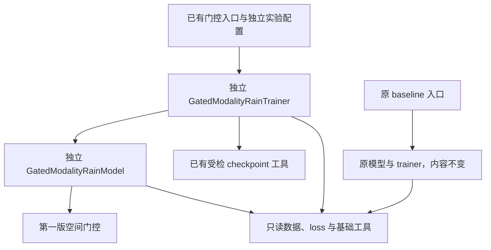

# 独立门控模型与 trainer 副本设计

_RainPrediction · 2026-09-03 · 用户已批准；本文明确迁移边界与验收条件_

---

## 🎯 目标与已确认约束

将第一版 `gated_modality_rain_trainer` 从“在共享 baseline 源码中加入门控”迁移到我们自己的独立模型和 trainer 副本。用户已明确确认独立副本，不采用继承原模型／trainer 或运行时修改原框架的方案。

本次改变代码组织与接入位置，不改变第一版的门控公式、初始化、训练 loss、数据协议和 GPU 运算方式。第一版算法仍以[原空间门控设计](2026-09-03-spatial-modality-gate-design.md)为依据；其中“修改原模型／trainer 文件”的接入方式由本设计取代。

原 baseline／他人代码必须保持不变；需要扩展或修复其中某个组件时，先新建独立文件，再让我们的框架引用新文件。此约束已写入项目 `AGENTS.md`。本次不删除数据、不覆盖用户 `.gitignore` 或其他未提交修改、不推送、不启动训练。

## 📦 文件组织与职责

在 `src/gated_modality_rain/` 建立独立代码包，保持现有门控 CLI 的入口路径：

| 文件 | 操作 | 职责 |
| --- | --- | --- |
| `src/gated_modality_rain/__init__.py` | 新增 | 标识代码包，不建立旧类名别名 |
| `src/gated_modality_rain/model.py` | 新增 | 定义独立 `GatedModalityRainModel`，包含本版门控与模型主体 |
| `src/gated_modality_rain/trainer.py` | 新增 | 定义独立 `GatedModalityRainTrainer`，包含本版训练主体与受检初始化 |
| `src/trainer/gated_modality_rain_trainer.py` | 修改本任务新增文件 | 通过 Hydra 构造并运行独立 trainer，保留既有模块／脚本入口 |
| `src/config/ts_rain_train/gated_modality_rain_trainer.yaml` | 修改本任务新增文件 | 将模型 `_target_` 指向独立模型，保留门控及实验配置 |
| `src/tests/time_series/test_spatial_modality_gate.py` | 修改本任务新增文件 | 门控侧使用独立模型，baseline 侧仍使用原模型 |
| `src/tests/trainer/test_gated_modality_rain_trainer.py` | 修改本任务新增文件 | 测试独立 trainer、配置、权重加载与 rollout |
| `src/tests/gated_modality_rain/test_framework_isolation.py` | 新增 | 检查原文件保护、新旧类隔离及副本行为 |

保留本任务已创建的 `src/utils/gated_checkpoint.py` 作为受检加载工具，不重复实现。固定起报 baseline 配置继续服务对照实验；原 baseline YAML 与模型配置不修改。门控配置可以只读继承既有配置，但不得写回或修改被继承文件。

## ⚙️ 核心副本与依赖边界

### 独立副本来源

模型与 trainer 副本以 `6c67b56` 中已通过服务器相关回归的第一版内容为迁移来源。新的公共类名分别为 `GatedModalityRainModel`、`GatedModalityRainTrainer`，类实现位于新包内，不继承、重导出或别名指向原 `RainCausalPatchTransformerNextFrame`、`RainTSNextFrameTrainer`。

模型内部所需的私有辅助类随模型主体复制；trainer 的训练方法及本文件辅助函数随 trainer 主体复制。原文件中的演示用 `__main__` 代码和原 trainer 的默认启动入口不迁入新类模块，避免新副本意外使用旧默认配置；已有门控入口作为唯一约定的启动入口。

允许只读导入现有数据加载器、基础网络积木、loss 函数和日志工具。这不是复制整个仓库或第三方依赖。独立维护的是模型与 trainer 主体；若今后需要改变只读复用组件的实现，也必须另建文件后切换我们的引用。

不使用 monkey patch、导入时替换、临时覆盖原类方法或全局函数的方式接入新逻辑。新框架的模型／trainer 主体不得通过导入原模型／trainer 再转发调用来冒充独立副本。

### 行为与权重契约

保留所有模型参数的 state-dict 键名、形状、初始化顺序及门控开关语义；模块路径与公共类名变化不能引入参数名前缀。原 baseline 权重、新版门控权重的受检初始化规则保持不变：只允许旧 baseline 缺失全部新增 gate 参数，其他缺失键、意外键或形状错误仍应拒绝。

门控保持逐帧二维空间计算，雷达和卫星各一张系数图，降水直接贡献不乘 gate；融合仍为 `z_base + (g_radar - 1)*z_radar + (g_satellite - 1)*z_satellite`。输出层零初始化使初始 gate 为 1。原 loss、优化器、EMA、梯度累积和 rollout 方法按第一版保留，不借迁移机会做算法重构。

保持 PyTorch CUDA、bf16 autocast、activation checkpoint 和正常反传路径，不新增 CPU 专用路径、不硬编码设备、不放宽数值比较容差。当前输入通道、448×448 配置、batch size 和固定起报设置均不变。

新文件使用项目要求的现代类型注解与英文注释，不新增兼容性别名或无关适配层。代码风格遵循现有 `pyproject.toml`，测试不运行 ty。

## 🔒 原 baseline 保护与回滚状态

以下两份原文件已经在上一轮本地恢复到 `9b02789` 的内容，本次迁移不得再次改变它们：

| 原文件 | 恢复后的 Git blob ID |
| --- | --- |
| `src/networks/time_series/causal_patch_transformer_next_frame.py` | `7a60fbf3da6723eb220cb9c793dbd091318b35b9` |
| `src/trainer/rain_trainer_ts_next_frame.py` | `d81d4b13db01c98af7c1a00c881784797b2da485` |

恢复后原有两文件相关测试为 43 passed、21 条既有警告。该结果只证明恢复后的 baseline 相关回归，不证明待迁移的新框架通过。

验收时对原文件再次做 Git 内容比较，并新增基于标准化换行内容的保护检查，避免 Windows／Linux 换行差异造成误报。原 baseline 测试文件也保持不变；修改范围限于新文件和本任务先前新增的门控入口、配置、测试与文档。

## ✅ 验证与验收

实现遵循先测试后迁移，新增隔离断言应能识别“仍调用原模型／trainer”或“原文件被改动”。验收包括：

1. 新模型／trainer 的类与实现模块独立，不是原类的子类、别名或运行时替换。
2. 原 baseline 文件与 `9b02789` 内容一致，原有相关测试仍通过。
3. 关闭门控的新模型副本，在相同参数与运行条件下保持原 baseline 的 state-dict 契约和输出；启用中性门控后也保持等价。
4. 新门控的非单位融合、梯度、时间位置独立性、AR／mask-token／返回接口、保存重载及非法配置测试通过。
5. 配置 `_target_`、入口 trainer 指向独立类；`--cfg job` 在模块与脚本模式下正常解析且不启动训练。
6. 独立 trainer 的受检初始化、固定起报 rollout 和既有训练计算得到测试覆盖，未在迁移中改变 loss 或引入未来模态真值。
7. 原有 4 个 FP32／BF16 × grad／no_grad 等价性用例和 2 个独立 CUDA 反传用例继续保留；baseline 比较侧必须使用原 baseline 模型，不能仅比较新副本的两个实例。
8. 语法、Ruff 与变更检查通过；本机无 CUDA 时如实记录跳过，迁移后的 GPU 路径需服务器重新执行，不能直接沿用迁移前的 104 passed 结论。

现有服务器启动路径继续为 `python -m src.trainer.gated_modality_rain_trainer`，但完成迁移前仍不可用于本地门控训练。代码就绪后给用户同步及复测命令，不自动推送或启动训练。

## ⚠️ 非目标与状态

不新增强降水门控监督、专用 gate loss、空间 mask、干预训练、预训练 VAE 或扩散模块。不修复原 decoder 的时间因果性问题，该问题仍按[已有诊断](../validation/2026-09-03-gated-modality-rain-trainer.md)另行确定范围；本次副本迁移不能被表述为已解决该问题。

本设计采用用户确认的独立副本方案，接受模型／trainer 主体代码重复的维护成本，以保证我们的后续修改不写入原框架。真实数据、实际 checkpoint、显存吞吐、DDP 和指标提升均不在本次结构迁移的已验证结论内。

本文已获用户批准并完成独立副本迁移；具体提交、相关回归与仍需服务器执行的 CUDA 复测见[迁移验证记录](../validation/2026-09-03-independent-gated-framework.md)。此状态更新不扩大本文原有范围，也不代表已开展真实训练或完成 GPU 验证。
