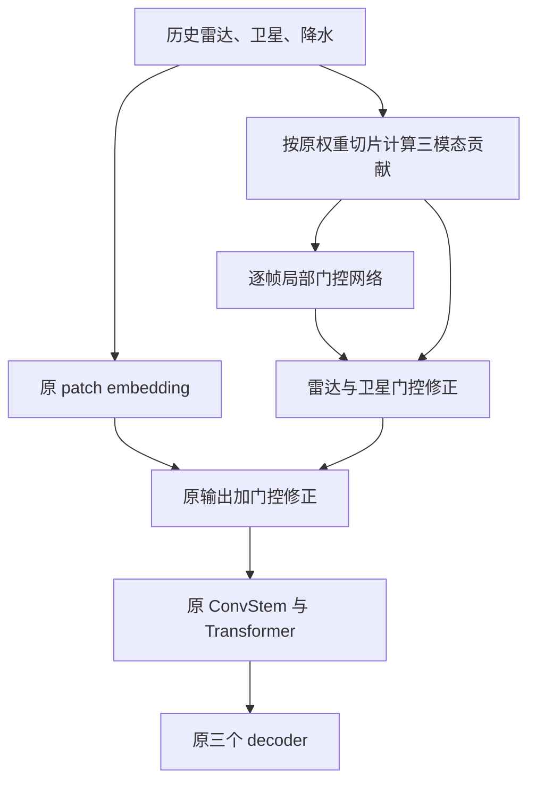

# 雷达与卫星空间门控：第一阶段结构设计

_RainPrediction · 2026-09-03 · 用户已批准；第一版名称：gated_modality_rain_trainer_

---

## 🎯 目标与范围

在用户指定的 [baseline 配置](../../../src/config/ts_rain_train/rain_trainer_ts_next_frame.yaml) 上，增加雷达和卫星的独立空间门控，保留历史降水的直接特征通路、原 Transformer、三个 decoder 及输出接口。

本阶段只实现结构和测试。不新增或修改预测 loss，不启用当前未生效的强降水加权项，不新增空间 mask、干预分支、一致性损失、门控监督、扩散阶段或训练任务。不删除数据、不修改现存 `.gitignore` 改动、不自动推送 GitHub。

固定起报是已确认的实验口径：只使用起报前四帧观测，预测未来四帧，不在 rollout 中补入真实未来雷达、卫星。训练中的右移 teacher forcing 保留；它不等同于固定起报的最终评估。

## 📋 当前结构与方案选择

当前 [模型配置](../../../src/config/ts_rain_train/rain_prediction_model/causal_patch_transformer_next_frame.yaml) 使用 `encoder_type=patch`、`frame_patch_size=1`、`patch_size=8`、`stem_channels=384`，不是预训练 VAE。输入按雷达 1、卫星 10、降水 1 通道拼接，在 [共享 patch embedding](../../../src/networks/time_series/causal_patch_transformer_next_frame.py) 中首次混合。

| 方案 | 作用位置 | 本阶段决定 |
| --- | --- | --- |
| 独立模态贡献门控 | 共享 patch embedding 与 ConvStem 之间 | 采用，复用原权重 |
| 三个新编码器再融合 | 编码器整体 | 不采用，改动与训练成本更大 |
| 现有 cross-modal adapter 加门控 | Transformer 之后的辅助分支 | 暂不采用，不能直接控制主干首次融合 |

## ⚙️ 数据流与门控定义

保留原 `patch_embed.weight` 和 `patch_embed.bias` 的名称、形状与参数对象。按输入通道切片复用卷积核，计算三个不含 bias 的贡献 `z_radar`、`z_satellite`、`z_rain`；不复制成三个独立可训练卷积核，也不执行 detach。

它们的形状均为 `[B, D, T, H/patch_size, W/patch_size]`。在本 baseline 中，`D=384`，空间网格为 `56×56`。



门控网络在每个 token 时间位置独立计算。将三模态特征拼接后，以逐帧 `1×1 Conv → SiLU → 3×3 depthwise Conv → SiLU → 1×1 Conv` 生成两个 logit 图；隐藏通道默认为 32，最后一层输出 2 通道。空间卷积使用零填充保持尺寸，不使用跨时间卷积或跨时间归一化。

两个门控分别为 `g_radar = 1 + tanh(a_radar)` 和 `g_satellite = 1 + tanh(a_satellite)`，各为 `[B, 1, T, H/patch_size, W/patch_size]`。门控相互独立，不做跨模态 softmax；卫星十个通道共享一个空间门控。它们是融合系数，不宣称是可靠性概率或真实因果贡献。

门控只读取模型当前输入中的模态特征，不增加未来真值或标签输入。历史降水可影响门控判断，但其直接线性贡献不乘门控。

### 恒等初始化与数值路径

最后一层的 weight 和 bias 均初始化为零，使初始两个 gate 都为 1。实际融合采用残差形式：

```text
z_base = original_patch_embed(x)
z_fused = z_base + (g_radar - 1) * z_radar
                   + (g_satellite - 1) * z_satellite
```

这在数学上等价于 `bias + g_radar*z_radar + g_satellite*z_satellite + z_rain`，但保留原始卷积的数值路径，避免单纯拆分再相加引入初始求和舍入差异。bias 只计入一次，不被门控。初始等价验证使用有限输入、相同设备和 dtype，以及关闭随机性的 eval 模式。

首步反向传播应能更新零初始化的输出层；其之前的门控层首步梯度可以为零，输出层更新后才向前传播非零梯度，这不作为失败条件。

## 🔧 配置、接口与权重加载

拟新增模型参数 `spatial_modality_gate_enabled=false` 和 `spatial_modality_gate_hidden_channels=32`。关闭时不实例化门控参数，直接执行原来的编码分支。开启时仅支持本阶段的 `encoder_type=patch`、`frame_patch_size=1`；不支持的组合显式报错，不隐式退回其他结构。隐藏通道必须为正，模态通道数必须与输入总通道一致。

门控统一接入 `_encode_tokens`，使直接前向、`forward_ar` 和 rollout 使用同一实现，不只处理 `context`。现有整模态 mask token 行为保持不变；不把本阶段称为新增的缺失模态鲁棒训练。

保留现有模型返回值：三模态字典或降水 tensor。不新增返回键、trainer 依赖或持久化的中间 gate 缓存。模块自身的门控输出用于单元测试；以后接入 loss 时再设计显式辅助输出接口。

旧 baseline 权重加载到门控模型时，所有旧参数保持同名同形；用现有非严格初始化加载方式，只允许新增门控参数缺失，禁止忽略其他缺失键、意外键或形状错误。门控模型自身保存与重载使用严格匹配。不把旧 optimizer 状态当成新架构的完整续训状态，也不擅自选择服务器 checkpoint。

### 独立的固定起报配置

不覆盖现有 baseline YAML，新增两个继承配置：

| 配置 | 门控 | 固定起报 |
| --- | --- | --- |
| `rain_trainer_ts_next_frame_fixed_origin.yaml` | 关闭 | 开启 |
| `gated_modality_rain_trainer.yaml` | 开启 | 开启 |

两者都通过公共固定起报配置设置 `train.next_pred.rollout_branch.use_gt_future_modalities=false`、`val.rollout_use_gt_future_modalities=false`，并使用独立输出目录。除门控和输出目录外，两者保持相同的数据、loss、优化器和训练预算设置；不启用 cross-modal adapter 或 local-window refiner。

新增同名入口 `src/trainer/gated_modality_rain_trainer.py`，默认选择 `gated_modality_rain_trainer` 配置并复用 `RainTSNextFrameTrainer`，不复制训练逻辑。使用旧入口时必须显式指定配置名，因为旧入口默认选择 `rain_trainer_ts_next_frame_delta_filter`。本阶段只验证配置解析，不启动训练。固定起报开关也不意味着原网络全链路因果性已得到证明。

## ✅ 验收标准

测试使用 pytest，放在 `src/tests/time_series/` 和 `src/tests/trainer/`；不运行 ty。新增测试先失败，再实现门控，最后回归现有相关测试。

| 检查 | 必须满足的条件 |
| --- | --- |
| 关闭开关 | 旧 state dict 严格加载；无新增参数；保持原输出 |
| 恒等初始化 | 加载相同原权重后，FP32 下编码特征与完整预测和 baseline 精确一致 |
| 模态与 bias | 非单位 gate 符合加权公式；只直接调整雷达、卫星贡献；bias 不重复 |
| 空间和时间 | 两个 gate 的形状正确；非零参数下可产生空间差异；较晚输入不影响较早门控输出 |
| 梯度 | 原 patch 权重与门控输出层得到有限梯度；输出层更新后更早门控层能学习 |
| 原接口 | 直接前向、AR、多种原返回模式保持兼容；既有 mask-token 测试回归 |
| 保存加载 | 新模型严格保存重载一致；旧模型初始化仅缺新增门控参数 |
| 参数约束 | 不支持的 encoder、时间 patch 和非法通道配置明确报错 |
| 固定起报 | 两份新配置均禁用 GT future modality 注入；rollout 改变未来标签不改变预测 |
| 范围 | loss 不变，无新增 mask，无数据写入，无训练任务启动 |

CPU 小尺寸 FP32 测试是必需项；有可用 CUDA 时补做真实训练 dtype 的前向、梯度有限性与等价性检查，并记录硬件和数值误差。没有 CUDA 时明确标注未验证，不用跳过结果冒充通过。

全链路时间因果性另做前缀扰动检查，尤其关注原 3D decoder 的时间归一化与填充。若该检查暴露既有问题，应报告并单独确定修复范围，不把无关修复混入门控，也不在解决前宣称固定起报评估已完全可靠。

## ⚠️ 代价与后续边界

门控增加了分模态卷积贡献计算和中间特征保存，不能仅凭参数量小声称没有开销。实现后报告新增参数量；真实吞吐和显存开销留给服务器上的受控验证。

本阶段通过只表示结构、初始化和接口正确，不表示 CSI 已提升，也不表示 gate 已学会可靠性。强降水阈值、专用 loss、干预采样策略和完整消融实验在下一阶段讨论后接入。

## 📍 审阅状态

用户已于 2026-09-03 批准本文设计，并指定第一版名称为 `gated_modality_rain_trainer`。本阶段进入实现与结构验证，不接入新 loss 或训练任务。
